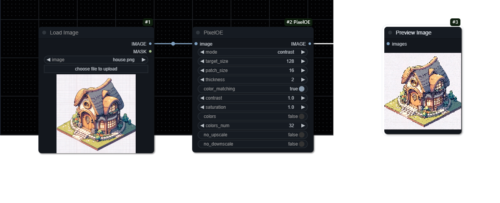

# A ComfyUI node for Pixelate image.

The comfyui node implementation for this [project](https://github.com/KohakuBlueleaf/PixelOE).

**Simply put, Pixelate the image**

- **No AI**
- **No NN**
- **GPU Free**

## Example/WorkFlow

---

## Installation
Clone the repository to `custom_nodes`:
```
git clone https://github.com/MakkiShizu/ComfyUI_PixelOE.git
```
nodes path：
- image/PixelOE

## Commands list
* Downscale mode list:
  * Nearest
  * Bicubic
  * Center: select the center pixel in the patch
  * Contrast: Contrast-based downscale method (see explantion below)
  * k-centroid: [k-centroid algorithm from Astropulse](https://github.com/Astropulse/pixeldetector/blob/6e88e18ddbd16529b5dd85b1c615cbb2e5778bf2/k-centroid.py#L19-L44)

## Citation

```bibtex
@misc{PixelOE,
    title={Detail-Oriented Pixelization based on Contrast-Aware Outline Expansion.}, 
    author={Shin-Ying Yeh},
    year={2024},
    month={March},
    howpublished=\url{https://github.com/KohakuBlueleaf/PixelOE},
}
```
